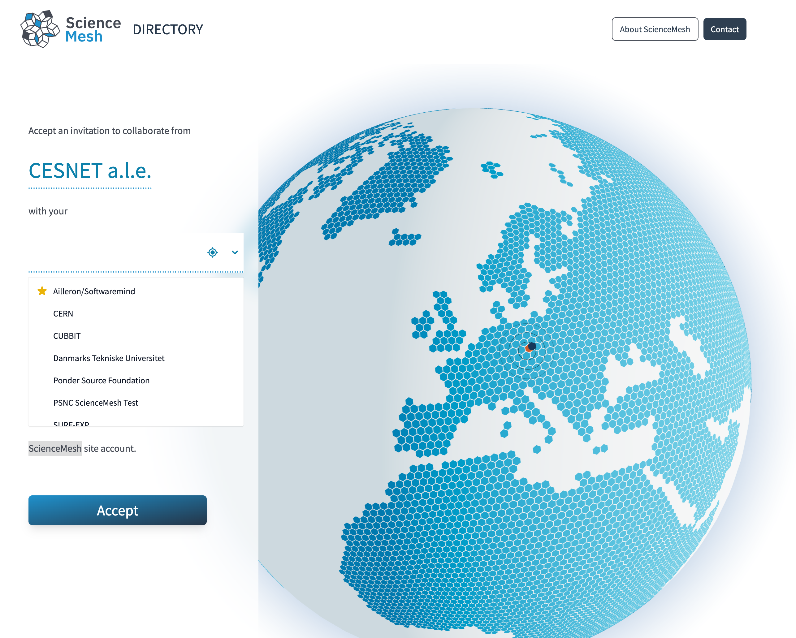

# meshdirectory-web

A WAYF portal service for the CS3 Science Mesh implemented with NextJS & React & ThreeJS.

[Live Demo](https://sciencemesh.cesnet.cz/iop/meshdir/?token=demo&providerDomain=sciencemesh.cesnet.cz)


## Requirements

- NodeJS >= 16
- React >= 18

## Installation

```shell
git clone https://github.com/sciencemesh/meshdirectory-web
yarn install
```

## Configuration

The service can be configured by setting the following Node environment variables:

| Name              | Description                                                             | Default value                                            |
| ----------------- | ----------------------------------------------------------------------- | -------------------------------------------------------- |
| **IOP_HOST**      | Hostname and port of your IOP deployment GRPC gateway                   | localhost:19000                                          |
| **IOP_INSECURE**  | Whether or not insecure connection to the IOP_HOST should be used       | false                                                    |
| **LOCATIONS_API** | API URL used to fetch mesh providers geolocation data                   | <https://iop.sciencemesh.uni-muenster.de/iop/mentix/loc> |
| **PROVIDERS_API** | Use this API to pull mesh providers metadata, instead of using IOP_HOST |                                                          |

This application periodically pulls metadata of CS3 mesh providers using one of configured methods:

### Using a Reva or CS3 APIs compliant service

Uses [ListAllProvidersRequest](https://cs3org.github.io/cs3apis/#cs3.ocm.provider.v1beta1.ListAllProvidersRequest) to
query info on all CS3 mesh providers from a configured `IOP_HOST` GRPC endpoint.

### Using Mentix Central database export API

When `PROVIDERS_API` is specified, this application fetches CS3 mesh providers list from that URL instead.

## Usage

To run the NextJS server with a production-optimized version of the app, execute:

```shell
yarn run build
yarn run start
```

## Contributing

### Local development

Setup and start a Reva instance to act as a simple IOP gateway:

```shell
git clone https://github.com/cs3org/reva
cd reva
make deps
make
mkdir -p /var/tmp/reva
cd example/
../reva/cmd/revad/revad -c revad.toml
```

Start the NextJS app in a development mode:

```shell
yarn run dev
```

### Docker development

You can run the whole deployment in Docker either by using Docker Compose

```shell
docker-compose up
```

or via provided VSCode Dev Container configs
